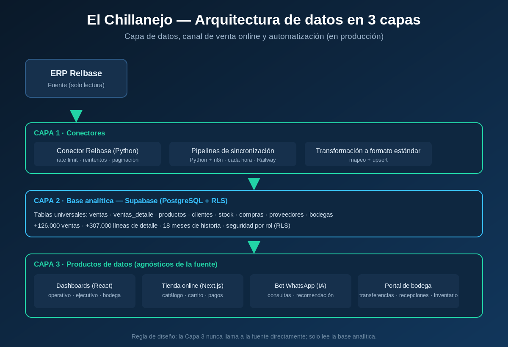

# El Chillanejo — Plataforma de Datos y Canal Digital (Caso de estudio)

> **Proyecto real en producción.** Caso de estudio del trabajo de Data Science que lidero en El Chillanejo, una distribuidora de aseo y abarrotes en Chillán, Chile.
>
> ⚠️ **Nota de confidencialidad.** El repositorio de trabajo original es **privado** por razones de seguridad y de cumplimiento de la **Ley 19.628** (protección de datos personales, Chile). Este repositorio es un **caso de estudio sanitizado**: describe la arquitectura y muestra fragmentos de código de ejemplo, **sin datos reales, sin credenciales y sin información comercial sensible**.

**Idioma / Language:** Español | [English](README.en.md)

---

## Resumen

Diseñé y construí, de punta a punta, la capa de datos y el canal de venta online de una distribuidora real. Hoy es **data science en producción**: se usa todos los días para decidir sobre inventario, márgenes, compras y ventas.

Mi perfil aporta una mezcla poco común: cinco años dirigiendo operaciones reales de negocio antes de dedicarme a los datos. Entiendo el problema desde adentro y le aplico método analítico.

---

## El problema

La empresa operaba sin una capa analítica propia: los datos vivían en el ERP, la reportería era manual y no existía canal de venta digital. El objetivo fue construir una base de datos confiable y automatizada, y sobre ella levantar dashboards, automatización y un canal online.

---

## Arquitectura

Sistema en **3 capas** desacopladas, diseñado para ser reutilizable con otras fuentes y otros clientes:

1. **Conectores** — extracción desde el ERP (solo lectura), con control de *rate limit*, reintentos y paginación; pipelines de sincronización incremental horaria (Python + n8n en Railway).
2. **Base analítica** — Supabase (PostgreSQL) con tablas universales (`ventas`, `ventas_detalle`, `productos`, `stock`, etc.) y seguridad a nivel de fila (RLS) por rol.
3. **Productos de datos** — dashboards, tienda online, bot de WhatsApp y portal de bodega. Esta capa nunca llama a la fuente: solo lee la base analítica.

---

## Qué construí

- **Integración ERP → PostgreSQL**: carga histórica de 18 meses (+126.000 ventas y +307.000 líneas de detalle) y sincronización incremental cada hora.
- **Tres dashboards** (operativo, ejecutivo y de bodega) en React, con KPIs de ventas, márgenes, evolución y alertas de stock, con control de acceso por rol.
- **Tienda online** en Next.js (catálogo, carrito y checkout con pagos integrados).
- **Bot de ventas por WhatsApp con IA**: consultas de ventas/stock en lenguaje natural y armado de carrito, usando un agente con *tool-use*.
- **Motor de recomendación de productos** basado en análisis de canastas (productos co-comprados e *itemsets* frecuentes).
- **Portal de operaciones de bodega**: transferencias entre bodegas, recepciones e inventario por escaneo de código de barras.

---

## Stack

Python (pandas, NumPy, scikit-learn) · SQL · PostgreSQL / Supabase · n8n · Railway · React · Next.js / TypeScript · APIs REST · IA conversacional (tool-use).

---

## Destacado técnico: ingesta con control de rate limit

Un ejemplo del tipo de problema de ingeniería resuelto: la API de origen permite ~7 requests/segundo. La solución autorregula el ritmo (intervalo en equilibrio), respeta el `Retry-After` del servidor ante un 429 y reintenta con *backoff* creciente.

Código de ejemplo (sanitizado): [`snippets/rate_limited_client.py`](snippets/rate_limited_client.py)

---

## Resultados

- Plataforma de datos **en producción**, usada a diario para decisiones de inventario, compras y precios.
- Reportería manual **eliminada**: los datos se actualizan solos cada hora.
- Canal de venta online operativo de punta a punta.

---

## Sobre mí

**Daniel A. Droguett Rozas** — Data Scientist (Chillán, Chile).
De la operación real a los datos: forecasting, KPIs y soluciones de IA en producción.

- LinkedIn: https://www.linkedin.com/in/daniel-a-droguett-rozas-b65a991b4/
- GitHub: https://github.com/danni-droguett-data-scientist
- Email: dannidro@gmail.com

---

*Este caso de estudio no incluye datos reales, credenciales ni información comercial sensible. Se publica con fines de portafolio profesional.*
